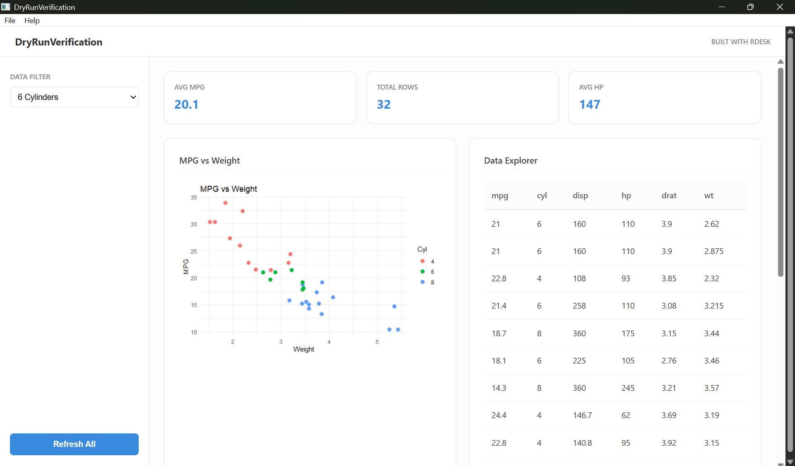

# RDesk

[](https://CRAN.R-project.org/package=RDesk)
[](https://github.com/Janakiraman-311/RDesk/actions/workflows/R-CMD-check.yml)
[](https://github.com/Janakiraman-311/RDesk/actions/workflows/build-app.yml)
[](https://janakiraman-311.github.io/RDesk/)



**RDesk** is a framework for building native Windows desktop applications with R. It turns your logic into a standalone `.exe` that runs on any machine—no R installation required by the end-user.

## Quick Start

Get a professional dashboard running in seconds:

```r
# 1. Install RDesk from CRAN
install.packages("RDesk")

# 2. Create a working dashboard
RDesk::rdesk_create_app("MyDashboard")
```

> **Install the development version from GitHub:**
> ```r
> devtools::install_github("Janakiraman-311/RDesk")
> ```

## Why RDesk?

RDesk solves the "Last Mile" problem of R deployment. Instead of a browser URL, you give your users a familiar Windows tool.

| Feature | Shiny | RDesk |
|:---|:---|:---|
| **Delivery** | Browser + Server | **Native .exe** |
| **Network Ports** | Yes (httpuv) | **Zero (Native Pipe)** |
| **Offline Use** | No | **Yes** |
| **Distribution** | Deploy to Cloud | **Single ZIP or Installer** |
| **User Experience** | Website-like | **Desktop Native** |

## Who uses RDesk?

- Data analysts building internal tools that cannot live on a server
- Consultants distributing one-off analysis tools to clients
- Teams replacing Excel macros with proper R-powered apps
- Organisations that need offline, zero-IT-involvement deployment

Not the right fit for web applications, cross-platform needs, 
or real-time collaborative tools — use Shiny for those.

## Core Benefits

*   **🔒 Zero-Port IPC**: Native bidirectional pipes between R and the UI. No firewall issues or port conflicts.
*   **⚡ Async by Default**: Built-in background task processing via `mirai`. The UI never freezes, even during heavy R computations.
*   **📦 Portable Runtime**: Packages a minimal R distribution into your `.exe`. Your users don't need to install R.
*   **🎨 Modern Web UI**: Use HTML/JS/CSS for the interface while keeping 100% of your logic in R.
*   **🛠 Professional Scaffolding**: Generate dashboards with sidebar navigation, Dark Mode, and auto-wired charts in one command.

## Distribute Your Work

Building a professional installer is a single command away:

```r
RDesk::build_app(
  app_dir         = "MyDashboard",
  app_name        = "SalesTool",
  build_installer = TRUE
)
# Output: dist/SalesTool-1.0.0-setup.exe
```

## Learn More

Visit the full documentation at **[janakiraman-311.github.io/RDesk](https://janakiraman-311.github.io/RDesk/)**

*   [**Getting Started**](https://janakiraman-311.github.io/RDesk/articles/getting-started.html) — From zero to your first native app.
*   [**Coming from Shiny**](https://janakiraman-311.github.io/RDesk/articles/shiny-migration.html) — A side-by-side guide to mapping your Shiny knowledge to RDesk.
*   [**Async Guide**](https://janakiraman-311.github.io/RDesk/articles/async-guide.html) — Mastering background tasks and progress overlays.
*   [**Cookbook**](https://janakiraman-311.github.io/RDesk/articles/cookbook.html) — Copy-paste recipes for common desktop patterns.

## License

MIT © Janakiraman G.
